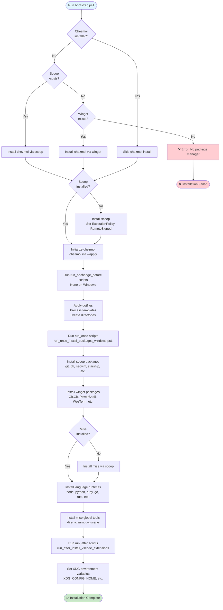
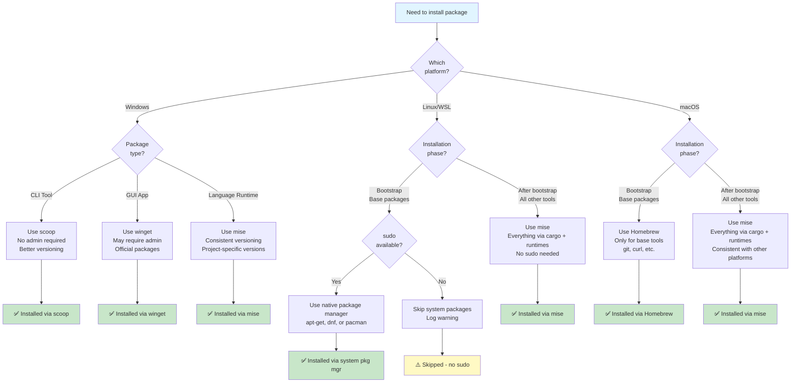
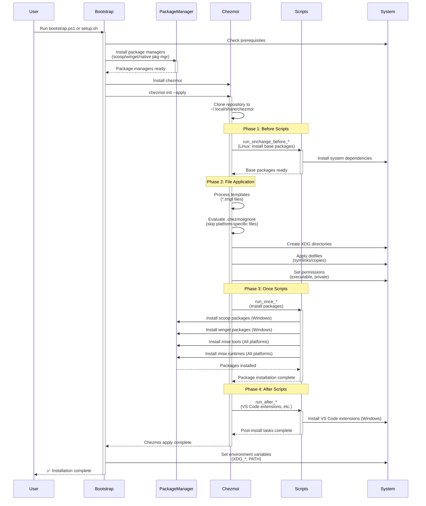
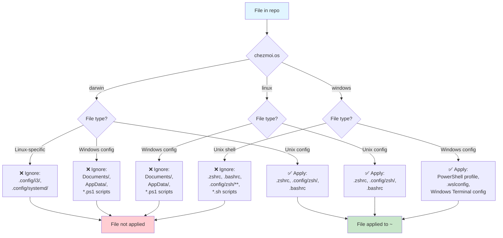

# Installation Guide

> **Comprehensive technical reference for dotfiles installation across Windows, Linux/WSL, and macOS**

This guide complements the [README.md](README.md) by providing detailed flowcharts, diagrams, and technical explanations of the installation process for each platform.

---

## Table of Contents

- [Overview](#overview)
- [Installation Flow by Platform](#installation-flow-by-platform)
  - [Windows Installation](#windows-installation)
  - [Linux/WSL Installation](#linuxwsl-installation)
  - [macOS Installation](#macos-installation)
- [Package Management Strategy](#package-management-strategy)
  - [Decision Tree](#package-manager-decision-tree)
  - [Platform Comparison](#platform-comparison-table)
- [Configuration Management](#configuration-management)
  - [Chezmoi Execution Order](#chezmoi-execution-order)
  - [File Linking Strategy](#file-linking-strategy)
  - [Platform-Specific Exclusions](#platform-specific-exclusions)
- [Feature Flags](#feature-flags)
- [Appendix](#appendix)
  - [Package Lists](#detailed-package-lists)
  - [Directory Structure](#xdg-directory-structure)
  - [Troubleshooting](#troubleshooting)

---

## Overview

The dotfiles installation process is designed for **one-command provisioning** across all platforms. The bootstrap scripts handle:

1. **Platform detection** and package manager installation
2. **Chezmoi installation** and initialization
3. **Package installation** (CLI tools, GUI apps, language runtimes)
4. **Configuration application** (templates, symlinks, platform-specific files)
5. **Environment setup** (shells, SSH, XDG directories)

**Total setup time**: ~5-10 minutes (depending on internet speed)

---

## Installation Flow by Platform

### Windows Installation



#### Windows Key Steps

1. **Chezmoi Installation**: Tries scoop first (preferred), falls back to winget
2. **Scoop Installation**: Installs scoop if missing (no admin required)
3. **Chezmoi Init**: Clones repo to `~/.local/share/chezmoi` and applies configs
4. **Scoop Packages**: Installs 20+ CLI tools (git, gh, lazygit, neovim, mise, starship, zoxide, fzf, ripgrep, fd, bat, eza, vivid, delta, jq, yq, 1password-cli, cygwin, make, zig, curl, wget, 7zip, btop)
5. **Winget Packages**: Installs GUI apps (Git.Git, PowerShell, WindowsTerminal, WezTerm, Warp, VS Code, 7zip)
6. **Mise Runtimes**: Installs language runtimes (node@lts, python@3.12, ruby@latest, go@latest, rust@stable, lua@latest, bun@latest, deno@latest)
7. **Mise Tools**: Installs global tools (direnv, 1password-cli, usage, yarn, uv)
8. **XDG Setup**: Configures XDG environment variables for Windows

**Requirements**:
- Windows 11 with PowerShell 5.1+
- Developer Mode enabled (for symlinks without admin)
- Internet connection

**Scripts executed**:
- `bootstrap.ps1` - Main bootstrap script
- `.chezmoiscripts/run_once_install_packages_windows.ps1.tmpl` - Package installation
- `.chezmoiscripts/run_after_install_vscode_extensions_windows.ps1.tmpl` - VS Code extensions

---

### Linux/WSL Installation

```mermaid
graph TD
    Start([Run setup.sh]) --> DetectPlatform[Detect platform<br/>Linux/WSL/macOS]
    
    DetectPlatform --> CheckWSL{WSL<br/>environment?}
    
    CheckWSL -->|Yes| LogWSL[Log: Detected WSL]
    CheckWSL -->|No| CheckBase
    
    LogWSL --> CheckBase{Essential packages<br/>installed?<br/>git, curl, make, unzip}
    
    CheckBase -->|No| DetectPkgMgr{Package<br/>manager?}
    CheckBase -->|Yes| SkipBase[Skip base packages]
    
    DetectPkgMgr -->|pacman| InstallArch[Install base packages<br/>Arch: base-devel git curl<br/>wget unzip zip openssl<br/>readline zlib libyaml<br/>libffi zsh]
    DetectPkgMgr -->|apt-get| InstallDebian[Install base packages<br/>Debian/Ubuntu: git curl wget<br/>unzip zip build-essential<br/>libssl-dev libreadline-dev<br/>zlib1g-dev libyaml-dev<br/>libffi-dev zsh]
    DetectPkgMgr -->|dnf| InstallFedora[Install base packages<br/>Fedora: git curl wget unzip<br/>zip gcc make openssl-devel<br/>readline-devel zlib-devel<br/>libyaml-devel libffi-devel zsh]
    DetectPkgMgr -->|brew| InstallMacBase[Install base packages<br/>macOS: git curl wget<br/>unzip openssl readline<br/>libyaml libffi zsh]
    
    InstallArch --> SetZsh
    InstallDebian --> SetZsh
    InstallFedora --> SetZsh
    InstallMacBase --> SetZsh
    SkipBase --> SetupXDG
    
    SetZsh[Set zsh as default shell<br/>chsh -s /bin/zsh] --> SetupXDG[Setup XDG directories<br/>mkdir -p ~/.config ~/.local/share<br/>~/.local/state ~/.cache]
    
    SetupXDG --> InstallChezmoiUnix[Install chezmoi<br/>curl https://get.chezmoi.io | sh<br/>chezmoi init --apply]
    
    InstallChezmoiUnix --> RunBeforeUnix[Run run_onchange_before scripts<br/>run_onchange_before_install_base_packages]
    
    RunBeforeUnix --> ApplyConfigsUnix[Apply dotfiles<br/>Process templates<br/>Create symlinks]
    
    ApplyConfigsUnix --> RunOnceUnix[Run run_once scripts<br/>run_once_install_packages_unix.sh]
    
    RunOnceUnix --> InstallMiseUnix{Mise<br/>installed?}
    
    InstallMiseUnix -->|No| InstallMiseScript[Install mise<br/>curl https://mise.run | sh]
    InstallMiseUnix -->|Yes| InstallMiseCLI
    
    InstallMiseScript --> InstallMiseCLI[Install CLI tools via mise<br/>ripgrep, fd, bat, eza,<br/>delta, bottom, starship, zoxide]
    
    InstallMiseCLI --> InstallRuntimesUnix[Install language runtimes<br/>node@lts, python@3.12,<br/>ruby@latest, go@latest,<br/>rust@stable, lua@latest,<br/>bun@latest, deno@latest]
    
    InstallRuntimesUnix --> InstallMiseToolsUnix[Install mise global tools<br/>direnv, yarn, uv, usage]
    
    InstallMiseToolsUnix --> CompleteUnix([✅ Installation Complete])
    
    style Start fill:#e1f5ff
    style CompleteUnix fill:#c8e6c9
```

#### Linux/WSL Key Steps

1. **Platform Detection**: Detects Linux distribution (Arch, Debian/Ubuntu, Fedora) and WSL
2. **Base Packages**: Installs essential build tools via native package manager (pacman/apt/dnf)
   - **Arch**: `base-devel git curl wget unzip zip openssl readline zlib libyaml libffi zsh`
   - **Debian/Ubuntu**: `git curl wget unzip zip build-essential libssl-dev libreadline-dev zlib1g-dev libyaml-dev libffi-dev zsh`
   - **Fedora**: `git curl wget unzip zip gcc gcc-c++ make openssl-devel readline-devel zlib-devel libyaml-devel libffi-devel zsh`
3. **Zsh Setup**: Sets zsh as default shell (requires logout/login)
4. **XDG Setup**: Creates XDG directory structure
5. **Chezmoi Installation**: One-line install via `get.chezmoi.io`
6. **Mise Installation**: Installs mise via `mise.run` script
7. **CLI Tools**: Installs CLI tools via mise using cargo backend (ripgrep, fd, bat, eza, delta, bottom, starship, zoxide)
8. **Language Runtimes**: Installs runtimes via mise (same as Windows)
9. **Global Tools**: Installs mise global tools (same as Windows)

**Requirements**:
- Linux distribution (Arch, Debian/Ubuntu, Fedora) or WSL
- sudo access (optional - only for base packages)
- Internet connection

**Scripts executed**:
- `setup.sh` - Main bootstrap script
- `.chezmoiscripts/run_onchange_before_install_base_packages_unix.sh.tmpl` - Base packages
- `.chezmoiscripts/run_once_install_packages_unix.sh.tmpl` - Mise packages

---

### macOS Installation

```mermaid
graph TD
    Start([Run setup.sh]) --> DetectMac[Detect macOS<br/>uname -s = Darwin]
    
    DetectMac --> CheckXcode{Xcode CLI<br/>tools installed?}
    
    CheckXcode -->|No| InstallXcode[Prompt: Install Xcode<br/>Command Line Tools<br/>xcode-select --install]
    CheckXcode -->|Yes| CheckHomebrew
    
    InstallXcode --> CheckHomebrew{Homebrew<br/>installed?}
    
    CheckHomebrew -->|No| InstallHomebrew[Install Homebrew<br/>/bin/bash -c curl...<br/>homebrew/install/HEAD/install.sh]
    CheckHomebrew -->|Yes| CheckBaseTools
    
    InstallHomebrew --> CheckBaseTools{Base tools<br/>installed?<br/>git, curl, wget, unzip}
    
    CheckBaseTools -->|No| InstallBrewBase[Install base tools via brew<br/>git curl wget unzip<br/>openssl readline<br/>libyaml libffi zsh]
    CheckBaseTools -->|Yes| SetZshMac
    
    InstallBrewBase --> SetZshMac[Set zsh as default shell<br/>chsh -s /bin/zsh]
    
    SetZshMac --> SetupXDGMac[Setup XDG directories<br/>mkdir -p ~/.config ~/.local/share<br/>~/.local/state ~/.cache]
    
    SetupXDGMac --> InstallChezmoiMac[Install chezmoi<br/>curl https://get.chezmoi.io | sh<br/>chezmoi init --apply]
    
    InstallChezmoiMac --> RunBeforeMac[Run run_onchange_before scripts<br/>run_onchange_before_install_base_packages]
    
    RunBeforeMac --> ApplyConfigsMac[Apply dotfiles<br/>Process templates<br/>Create symlinks]
    
    ApplyConfigsMac --> RunOnceMac[Run run_once scripts<br/>run_once_install_packages_unix.sh]
    
    RunOnceMac --> InstallMiseMac{Mise<br/>installed?}
    
    InstallMiseMac -->|No| InstallMiseScriptMac[Install mise<br/>curl https://mise.run | sh]
    InstallMiseMac -->|Yes| CheckBrewPkgs
    
    InstallMiseScriptMac --> CheckBrewPkgs{Homebrew packages<br/>enabled in data file?}
    
    CheckBrewPkgs -->|Yes| InstallBrewPkgs[Install homebrew packages<br/>warp, wezterm, starship,<br/>zoxide, fzf, ripgrep, fd,<br/>bat, eza, delta, btop,<br/>neovim, gh, lazygit]
    CheckBrewPkgs -->|No| InstallRuntimesMac
    
    InstallBrewPkgs --> InstallRuntimesMac[Install language runtimes via mise<br/>node@lts, python@3.12,<br/>ruby@latest, go@latest,<br/>rust@stable, lua@latest,<br/>bun@latest, deno@latest]
    
    InstallRuntimesMac --> InstallMiseToolsMac[Install mise global tools<br/>direnv, yarn, uv, usage]
    
    InstallMiseToolsMac --> CompleteMac([✅ Installation Complete])
    
    style Start fill:#e1f5ff
    style CompleteMac fill:#c8e6c9
```

#### macOS Key Steps

1. **Platform Detection**: Detects macOS via `uname -s`
2. **Xcode CLI Tools**: Prompts to install if missing (required for compilation)
3. **Homebrew Bootstrap**: Installs Homebrew if missing (only for bootstrap)
4. **Base Packages**: Installs base tools via Homebrew (git, curl, wget, unzip, openssl, readline, libyaml, libffi, zsh)
5. **Zsh Setup**: Sets zsh as default shell
6. **XDG Setup**: Creates XDG directory structure
7. **Chezmoi Installation**: One-line install via `get.chezmoi.io`
8. **Mise Installation**: Installs mise via `mise.run` script
9. **Optional Homebrew Packages**: Can install additional packages via Homebrew (warp, wezterm, terminals, CLI tools)
10. **Language Runtimes**: Installs runtimes via mise (same as other platforms)
11. **Global Tools**: Installs mise global tools (same as other platforms)

**Note**: After bootstrap, prefer mise over Homebrew for tools. Homebrew is only used for initial setup.

**Requirements**:
- macOS 10.15+ (Catalina or later)
- Xcode Command Line Tools
- Internet connection

**Scripts executed**:
- `setup.sh` - Main bootstrap script
- `.chezmoiscripts/run_onchange_before_install_base_packages_unix.sh.tmpl` - Base packages
- `.chezmoiscripts/run_once_install_packages_unix.sh.tmpl` - Mise packages

---

## Package Management Strategy

### Package Manager Decision Tree



### Platform Comparison Table

| Category | Windows | Linux/WSL | macOS |
|----------|---------|-----------|-------|
| **Bootstrap Package Manager** | winget (chezmoi) | native (git, curl, build tools) | Homebrew (base tools) |
| **CLI Tools** | scoop | mise (via cargo) | mise (via cargo) |
| **GUI Applications** | winget | N/A | Homebrew (optional) |
| **Language Runtimes** | mise | mise | mise |
| **Global Tools** | mise | mise | mise |
| **Config Management** | chezmoi | chezmoi | chezmoi |
| **Symlink Strategy** | chezmoi built-in | chezmoi built-in | chezmoi built-in |
| **XDG Compliance** | ✅ Yes | ✅ Yes | ✅ Yes |

### Rationale

**Windows**:
- **scoop**: Preferred for CLI tools (no admin, better versioning, cleaner uninstalls)
- **winget**: For GUI apps and packages requiring system integration
- **mise**: For language runtimes to maintain consistency with Unix

**Linux/WSL**:
- **Native package manager** (apt/dnf/pacman): Only for bootstrap essentials (git, build-essential)
- **mise**: Everything else (CLI tools via cargo, language runtimes) - no sudo needed after bootstrap

**macOS**:
- **Homebrew**: Only for bootstrap (git, curl, base libraries)
- **mise**: Everything after bootstrap - consistent with Linux/WSL

**Why mise everywhere?**
- Consistent tool versions across platforms
- Project-specific version management (`.mise.toml`, `.tool-versions`)
- No admin/sudo required after initial setup
- Single source of truth for language runtimes

---

## Configuration Management

### Chezmoi Execution Order



### Script Execution Order

Chezmoi executes scripts in the following order:

1. **`run_onchange_before_*`**: Run before file application, re-run when data file changes
   - Example: `run_onchange_before_install_base_packages_unix.sh.tmpl`
   - Used for: Installing system dependencies (Linux/WSL only)

2. **File application**: Chezmoi applies all dotfiles (templates, symlinks, copies)

3. **`run_once_*`**: Run once after file application
   - Example: `run_once_install_packages_windows.ps1.tmpl`, `run_once_install_packages_unix.sh.tmpl`
   - Used for: Installing packages via scoop/winget/mise

4. **`run_after_*`**: Run after all other operations
   - Example: `run_after_install_vscode_extensions_windows.ps1.tmpl`
   - Used for: Post-installation tasks

**Script naming conventions**:
- `run_once_*`: Runs once (tracked in `~/.local/share/chezmoi/chezmoistate.boltdb`)
- `run_onchange_*`: Runs when file or data changes (checksum-based)
- `run_after_*`: Runs after all other scripts
- `*.tmpl`: Template files (processed by chezmoi)
- `*.ps1`: PowerShell scripts (Windows only via `.chezmoiignore`)
- `*.sh`: Shell scripts (Unix only via `.chezmoiignore`)

---

### File Linking Strategy

Chezmoi manages files using a combination of symlinks, copies, and templates.

#### Windows Strategy

**Directory structure**:
```
~/.local/share/chezmoi/      # Source directory
├── dot_config/              → ~/.config/
│   ├── git/                 → ~/.config/git/
│   ├── nvim/                → ~/.config/nvim/
│   └── wezterm/             → ~/.config/wezterm/
├── Documents/               → ~/Documents/
│   └── PowerShell/          → ~/Documents/PowerShell/
└── AppData/                 → ~/AppData/
    └── Roaming/             → ~/AppData/Roaming/
```

**Linking method**:
- Chezmoi creates symlinks automatically (requires Developer Mode)
- Uses native Windows symlinks (not junction points)
- XDG-compliant paths on Windows (`~/.config`, `~/.local/share`)

**Template processing**:
```
File in repo:                    Applied to:
---------------------------------------------
dot_gitconfig.tmpl          →   ~/.gitconfig
dot_config/git/config.tmpl  →   ~/.config/git/config
```

Templates use Go template syntax:
```go
{{ if eq .chezmoi.os "windows" }}
# Windows-specific config
{{ end }}
```

#### Linux/WSL/macOS Strategy

**Directory structure**:
```
~/.local/share/chezmoi/      # Source directory
├── dot_config/              → ~/.config/
│   ├── git/                 → ~/.config/git/
│   ├── nvim/                → ~/.config/nvim/
│   ├── zsh/                 → ~/.config/zsh/
│   └── wezterm/             → ~/.config/wezterm/
└── dot_zshrc                → ~/.zshrc
```

**Linking method**:
- Chezmoi creates symlinks automatically
- Standard Unix symlinks (`ln -s`)
- XDG-compliant paths

**Template processing**: Same as Windows

---

### Platform-Specific Exclusions

Chezmoi uses `.chezmoiignore` to exclude platform-specific files:



#### Exclusion Rules

**On Windows, exclude**:
- Unix shell configs: `.zshrc`, `.bashrc`, `.config/zsh/**`
- Unix-specific scripts: `*.sh`, `.chezmoiscripts/**/*.sh.tmpl`
- Unix-only tools: `.tmux.conf`, `.xinitrc`, `.Xresources`
- Linux display managers: `.config/i3/`, `.config/sway/`
- macOS-specific: `Library/`, `.config/karabiner/`

**On Linux/Unix, exclude**:
- Windows PowerShell: `Documents/`, `AppData/`
- Windows-specific scripts: `*.ps1`, `.chezmoiscripts/**/*.ps1.tmpl`
- Windows configs: `.wslconfig`, `.config/mise/config.windows.toml`

**On macOS, exclude**:
- Windows configs: Same as Linux
- Linux-specific: `.config/systemd/`, `.config/i3/`

**Feature flag exclusions** (example):
```yaml
# .chezmoiignore
{{- if not .package_features.rust }}
.config/zsh/.zshrc.d/70-rust.zsh
.cache/zsh/completions/_rustc
{{- end }}
```

See [Feature Flags](#feature-flags) for complete list.

---

## Feature Flags

Feature flags control which optional packages and configurations are applied. Defined in `.chezmoidata.yaml`:

### Available Flags

| Flag | Default | Description | Controls |
|------|---------|-------------|----------|
| **Language Packages** | | | |
| `rust` | ✅ `true` | Rust environment | `.config/zsh/.zshrc.d/70-rust.zsh`, cargo completions |
| `golang` | ✅ `true` | Go environment | `.config/zsh/.zshrc.d/70-golang.zsh`, GOPATH setup |
| `python` | ✅ `true` | Python environment | `.config/zsh/.zshrc.d/70-python.zsh`, virtual env config |
| `ruby` | ✅ `true` | Ruby environment | `.config/zsh/.zshrc.d/70-ruby.zsh`, gem config |
| `lua` | ✅ `true` | Lua environment | `.config/zsh/.zshrc.d/70-lua.zsh` |
| `node` | ✅ `true` | Node.js environment | `.config/zsh/.zshrc.d/70-node.zsh` |
| `perl` | ✅ `true` | Perl environment | `.config/zsh/.zshrc.d/70-perl.zsh` (future) |
| `php` | ❌ `false` | PHP environment | `.config/zsh/.zshrc.d/70-php.zsh` (future) |
| **Development Tools** | | | |
| `arduino` | ❌ `false` | Arduino IDE config | `.config/arduino/**` (future) |
| `glow` | ✅ `true` | Markdown viewer | `.config/glow/**`, `.config/zsh/.zshrc.d/90-glow.zsh` |
| `tinted_theming` | ✅ `true` | Base16/Base24 themes | `.config/tinted-theming/**`, `.local/share/tinted-theming/**` |
| `thefuck` | ✅ `true` | Command corrector | `.config/zsh/.zshrc.d/thefuck.zsh` (future) |
| `sqlite3` | ✅ `true` | SQLite CLI config | `.config/sqlite3/**` |
| `vim` | ❌ `false` | Vim config | `.vimrc`, `.config/vim/**` (using neovim) |
| `vivid` | ✅ `true` | LS_COLORS generator | `.config/vivid/**` |
| `warp` | ✅ `true` | Warp terminal | `.config/warp/**` |
| **Deprecated** | | | |
| `asdf` | ❌ `false` | ASDF version manager | Replaced by mise |
| `nvm` | ❌ `false` | NVM (Node Version Manager) | Replaced by mise |
| `homebrew` | ❌ `false` | Homebrew configs | Bootstrap only, not managed |
| `vagrant` | ❌ `false` | Vagrant configs | Not actively used |

### Core Packages (Always Enabled)

These are **always installed** regardless of feature flags:
- git, nvim, wezterm, starship, mise
- bat, direnv, eza, fzf, ripgrep, wget
- zsh (Unix), PowerShell (Windows)
- ssh, 1password integration
- Windows Terminal, WSL config (Windows only)

### How to Enable/Disable Flags

**Method 1: Edit `.chezmoidata.yaml` before bootstrap**

```yaml
package_features:
  rust: true      # Enable rust
  python: false   # Disable python
  php: true       # Enable php
```

**Method 2: Edit after installation**

```bash
# Edit chezmoi source
chezmoi edit ~/.local/share/chezmoi/.chezmoidata.yaml

# Apply changes
chezmoi apply
```

**Method 3: Use chezmoi data**

```bash
# Check current value
chezmoi data | jq '.package_features.rust'

# Edit and apply
chezmoi edit --apply .chezmoidata.yaml
```

### Examples

**Minimal installation (only core tools)**:
```yaml
package_features:
  rust: false
  golang: false
  python: false
  ruby: false
  lua: false
  node: false
  perl: false
  php: false
  glow: false
  tinted_theming: false
  thefuck: false
  sqlite3: false
  vivid: false
  warp: false
```

**Full-stack web development**:
```yaml
package_features:
  rust: true
  golang: true
  python: true
  ruby: true
  lua: true
  node: true
  php: true
  sqlite3: true
  glow: true
  vivid: true
  warp: true
```

**Go/Rust systems programming**:
```yaml
package_features:
  rust: true
  golang: true
  python: false
  ruby: false
  lua: false
  node: false
  perl: false
  php: false
```

---

## Appendix

### Detailed Package Lists

#### Windows Packages

**Scoop packages** (CLI tools, no admin):
```yaml
scoop_packages:
  - git                 # Version control
  - gh                  # GitHub CLI
  - lazygit             # Git TUI
  - chezmoi             # Dotfile manager
  - mise                # Version manager
  - starship            # Prompt
  - zoxide              # Smart cd
  - fzf                 # Fuzzy finder
  - ripgrep             # Fast grep
  - fd                  # Fast find
  - bat                 # Cat with syntax
  - eza                 # Modern ls
  - vivid               # LS_COLORS
  - delta               # Git diff viewer
  - jq                  # JSON processor
  - yq                  # YAML processor
  - neovim              # Editor
  - 1password-cli       # 1Password CLI
  - cygwin              # Unix compatibility
  - make                # Build tool
  - zig                 # C/C++ compiler (for native builds)
  - curl                # URL transfer
  - wget                # Download tool
  - 7zip                # Archive tool
  - btop                # System monitor
```

**Winget packages** (GUI apps):
```yaml
winget_packages:
  - Git.Git                     # Git with GCM
  - Microsoft.PowerShell        # PowerShell 7+
  - Microsoft.WindowsTerminal   # Windows Terminal
  - wez.wezterm                 # WezTerm terminal
  - Warp.Warp                   # Warp terminal
  - Microsoft.VisualStudioCode  # VS Code
  - 7zip.7zip                   # 7-Zip
```

**Mise runtimes** (cross-platform):
```yaml
mise_runtimes:
  node: "lts"        # Node.js LTS
  python: "3.12"     # Python 3.12
  ruby: "latest"     # Latest Ruby
  perl: "latest"     # Latest Perl
  go: "latest"       # Latest Go
  rust: "stable"     # Rust stable
  lua: "latest"      # Latest Lua
  bun: "latest"      # Latest Bun
  deno: "latest"     # Latest Deno
```

**Mise global tools**:
```yaml
mise_global_tools:
  - direnv            # Environment switcher
  - 1password-cli     # 1Password CLI (alternative install)
  - usage             # CLI spec generator
  - yarn              # Node package manager
  - uv                # Fast Python package installer
```

#### Linux/WSL Packages

**Base system packages**:

*Arch Linux* (pacman):
```
sudo base-devel git curl wget unzip zip openssl readline zlib libyaml libffi zsh
```

*Debian/Ubuntu* (apt-get):
```
git curl wget unzip zip build-essential libssl-dev libreadline-dev zlib1g-dev libyaml-dev libffi-dev zsh
```

*Fedora/RHEL* (dnf):
```
git curl wget unzip zip gcc gcc-c++ make openssl-devel readline-devel zlib-devel libyaml-devel libffi-devel zsh
```

**Mise CLI tools** (via cargo):
```yaml
mise_cli_tools:
  - ripgrep          # Fast grep
  - fd               # Fast find
  - bat              # Cat with syntax
  - eza              # Modern ls
  - delta            # Git diff viewer
  - bottom           # System monitor (btop alternative)
  - starship         # Prompt
  - zoxide           # Smart cd
```

**Mise runtimes**: Same as Windows

**Mise global tools**: Same as Windows

#### macOS Packages

**Homebrew base packages** (bootstrap only):
```
git curl wget unzip openssl readline libyaml libffi zsh
```

**Mise CLI tools** (via cargo - same as Linux):
```yaml
mise_cli_tools:
  - ripgrep          # Fast grep
  - fd               # Fast find
  - bat              # Cat with syntax
  - eza              # Modern ls
  - delta            # Git diff viewer
  - bottom           # System monitor (btop alternative)
  - starship         # Prompt
  - zoxide           # Smart cd
```

**Homebrew GUI apps** (terminals only):
```yaml
  - warp             # Warp terminal
  - wezterm          # WezTerm terminal
```

**Mise runtimes**: Same as Windows

**Mise global tools**: Same as Windows

---

### XDG Directory Structure

All platforms follow the XDG Base Directory specification:

```
~/.config/                    # XDG_CONFIG_HOME (user configurations)
├── git/                      # Git configuration
│   ├── config                # Git config
│   ├── ignore                # Global gitignore
│   └── attributes            # Git attributes
├── nvim/                     # Neovim configuration
│   ├── init.lua              # Neovim init
│   ├── lazy-lock.json        # Plugin lockfile
│   └── lua/                  # Lua configs
├── wezterm/                  # WezTerm configuration
│   └── wezterm.lua           # WezTerm config
├── starship/                 # Starship configuration
│   └── starship.toml         # Prompt config
├── mise/                     # Mise configuration
│   ├── config.toml           # Mise config
│   └── config.<platform>.toml # Platform-specific
├── zsh/                      # Zsh configuration (Unix only)
│   ├── .zshrc.d/             # Zsh modules
│   └── functions/            # Zsh functions
├── bat/                      # Bat configuration
│   └── config                # Bat config
├── vivid/                    # Vivid themes
│   └── themes/               # Color themes
├── glow/                     # Glow markdown viewer
│   └── glow.yml              # Glow config
├── warp/                     # Warp terminal
│   └── themes/               # Custom themes
└── [language configs]/       # Per-language configs

~/.local/share/               # XDG_DATA_HOME (user data)
├── chezmoi/                  # Chezmoi source directory
├── mise/                     # Mise installations
│   ├── installs/             # Installed tools
│   └── shims/                # Mise shims
└── tinted-theming/           # Base16/Base24 themes

~/.local/state/               # XDG_STATE_HOME (state data)
└── [application state]/      # App-specific state

~/.cache/                     # XDG_CACHE_HOME (cache data)
├── mise/                     # Mise cache
├── zsh/                      # Zsh cache (Unix only)
│   └── completions/          # Zsh completions
└── [application caches]/     # App-specific caches

~/.local/bin/                 # User binaries (not XDG, but standard)
└── [custom scripts]/         # User scripts

# Platform-specific (Windows only)
~/Documents/PowerShell/       # PowerShell profile
~/AppData/Roaming/Code/       # VS Code settings
```

**Environment variables**:
```bash
# Unix/Linux/macOS
export XDG_CONFIG_HOME="$HOME/.config"
export XDG_DATA_HOME="$HOME/.local/share"
export XDG_STATE_HOME="$HOME/.local/state"
export XDG_CACHE_HOME="$HOME/.cache"

# Windows (PowerShell)
$env:XDG_CONFIG_HOME = "$env:USERPROFILE\.config"
$env:XDG_DATA_HOME = "$env:USERPROFILE\.local\share"
$env:XDG_STATE_HOME = "$env:USERPROFILE\.local\state"
$env:XDG_CACHE_HOME = "$env:USERPROFILE\.cache"
```

---

### Troubleshooting

#### Windows Issues

**Problem**: Symlinks not created (permission denied)
- **Solution**: Enable Developer Mode in Windows Settings
  - Settings → Update & Security → For developers → Developer Mode
  - Or run as administrator (not recommended)

**Problem**: Scoop installation fails with execution policy error
- **Solution**: Set execution policy
  ```powershell
  Set-ExecutionPolicy -ExecutionPolicy RemoteSigned -Scope CurrentUser
  ```

**Problem**: Winget package installation requires admin
- **Solution**: Some packages require admin rights. Either:
  - Run PowerShell as administrator
  - Or skip winget packages and use scoop alternatives

**Problem**: Mise not found after installation
- **Solution**: Restart terminal or refresh PATH
  ```powershell
  $env:PATH = [System.Environment]::GetEnvironmentVariable("Path", "Machine") + ";" + [System.Environment]::GetEnvironmentVariable("Path", "User")
  ```

#### Linux/WSL Issues

**Problem**: No sudo access for base packages
- **Solution**: Base packages will be skipped. Install manually:
  ```bash
  # Arch
  su -c "pacman -Syu base-devel git curl"
  
  # Debian/Ubuntu
  su -c "apt-get update && apt-get install -y build-essential git curl"
  
  # Or ask system administrator
  ```

**Problem**: Zsh not set as default shell
- **Solution**: Run manually
  ```bash
  chsh -s $(which zsh)
  # Then log out and back in
  ```

**Problem**: Mise cargo installs fail (missing dependencies)
- **Solution**: Install build dependencies
  ```bash
  # Debian/Ubuntu
  sudo apt-get install -y build-essential libssl-dev
  
  # Arch
  sudo pacman -S base-devel openssl
  ```

**Problem**: WSL 1Password SSH agent not working
- **Solution**: Ensure 1Password SSH agent is enabled and npiperelay is configured
  - See: https://developer.1password.com/docs/ssh/agent/wsl

#### macOS Issues

**Problem**: Xcode Command Line Tools not installed
- **Solution**: Install manually
  ```bash
  xcode-select --install
  ```

**Problem**: Homebrew installation fails
- **Solution**: Install manually
  ```bash
  /bin/bash -c "$(curl -fsSL https://raw.githubusercontent.com/Homebrew/install/HEAD/install.sh)"
  ```

**Problem**: Mise cargo installs fail on Apple Silicon
- **Solution**: Ensure Rosetta 2 is installed (if needed)
  ```bash
  softwareupdate --install-rosetta
  ```

#### General Issues

**Problem**: Chezmoi apply fails with template errors
- **Solution**: Check `.chezmoidata.yaml` for syntax errors
  ```bash
  chezmoi execute-template --init < .chezmoidata.yaml
  ```

**Problem**: Packages not installing (network issues)
- **Solution**: Check internet connection and retry
  ```bash
  # Retry package installation
  mise install
  scoop update * # Windows
  ```

**Problem**: Configs not applied (file ignored)
- **Solution**: Check `.chezmoiignore` for exclusion rules
  ```bash
  chezmoi ignored
  ```

**Problem**: Want to reset and start over
- **Solution**: Remove chezmoi and source directory
  ```bash
  # Unix
  rm -rf ~/.local/share/chezmoi ~/.config/chezmoi
  
  # Windows
  Remove-Item -Recurse -Force "$env:USERPROFILE\.local\share\chezmoi", "$env:USERPROFILE\.config\chezmoi"
  
  # Then re-run bootstrap
  ```

---

## See Also

- [README.md](README.md) - Main documentation and quick start
- [WARP.md](WARP.md) - AI agent technical reference
- [Chezmoi Documentation](https://www.chezmoi.io/)
- [Mise Documentation](https://mise.jdx.dev/)
- [Scoop Documentation](https://scoop.sh/)

---

**Last updated**: 2025-01-19  
**Version**: 1.0.0  
**Platforms**: Windows 11, Linux (Arch/Debian/Fedora), WSL2, macOS 10.15+
